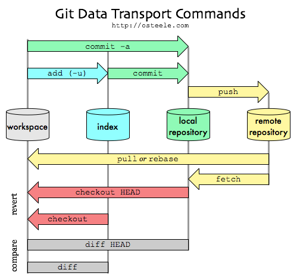

***


# IMS R style guide

## External Sources

* [Hadley style guide](http://stat405.had.co.nz/r-style.html)
* [Google style guide](https://google.github.io/styleguide/Rguide.xml)

If hadley and google contradict each other:

1. prio: hadley
2. prio: google

## Naming Conventions
Files end with '.R': `meaningful-file.R`  
Variables: `meaningful_variable`  
Functions: `meaningful_function`

Versionning. Given a version number MAJOR.MINOR.PATCH, increment the:

* MAJOR version when you make incompatible API changes,
* MINOR version when you add functionality in a backwards-compatible manner, and
* PATCH version when you make backwards-compatible bug fixes.

Additional labels for pre-release and build metadata are available as extensions 
to the MAJOR.MINOR.PATCH format. For further details see <http://semver.org/>

## Indentation  
When indenting your code, use two spaces.  Never use tabs or mix tabs and spaces.
Spacing
Place spaces around all binary operators (=, +, -, <-, etc.).
Do not place a space before a comma, but always place one after a comma.
Place a space before left parenthesis, except in a function call.

## General Layout and Ordering
1. Copyright statement comment
2. Author comment
3. File description comment, including purpose of program, inputs, and outputs
4. source() and library() statements
5. Function definitions
6. Executed statements, if applicable (e.g., print, plot)

Unit tests should go in a separate file named `test_originalfunction(s).R`.  

Install packages with `install.packages("package")`  

Include non-standard packages using `libraray(package)`

***


# R, Rtools and Rstudio

## Install R and Rtools

For windows: Install latest R version from <https://cran.r-project.org/bin/windows/base/>
and install it to C:/R/R-x.x.x. Do not install it to the program folder because 
you will run into trouble with admin right.  

Next install latest Rtools version to C:/Rtools. The file (It is not a package) 
can be downloaded from here: >https://cran.r-project.org/bin/windows/Rtools/>
Be careful with path conventions. R needs "/"!

```
Be careful: Here, you have to add the system path "C:/R/R-x.x.x/bin;"
```
For further help see <http://socserv.mcmaster.ca/jfox/Courses/R/ICPSR/R-install-instructions.html>

## Install RStudio

Install Editor from [here](https://www.rstudio.com/products/rstudio/download/)
Most likely you have to install further packages.
Either go to Rstudio and use the console
```
> install.packages(c("devtools", "testthat", "ggplot2", "knitr", "lme4", "MBESS", 
  "mi", "polycor", "readxl", "rgl", "rmarkdown", "sem", "sfsmisc"))
```
or use the built in package Editor => Install
```
Important note: Install packages always to C:/R/R-x.x.x/
```

It might also be useful to install [MikTex](http://miktex.org/download) to be 
able to Rmarkdown.

Finally, make sure, you installed the packages

* devtools used for downloading and installing code from github and 
* testthat 

When you want to automate testing open or create a project (including package) and type the 
following command in the R console:
```
> devtools::use_testthat()
```
This creates the test_that folders. When you change the project in RStudio, you 
start with a **clear environment** and a **clear shell**. For Details see 
Hadley "R packages", Ch. 7. 

## Install a package with auth_token

In RStudio use the following command in the R console
```
devtools::install_github("ims-fhs/repo", auth_token = "35b77ed8d745a9572409e6c153e20e36d45094ed")
```

# Git and GitHub

## External Sources and quick tour for impatient guys

* Hadley: How to set up Rstudio, git/SVN and github <http://r-pkgs.had.co.nz/git.html>
* Github help on git's clone, fetch, pull, merge <https://help.github.com/articles/fetching-a-remote/>
* Excellent [git tutorial](https://git-scm.com/book/en/v2/). **Read at least the
the first three chapters**.

Use the following commands to track and understand what is going on. For 
explanations see below. However, these commands are save and you can't screw 
anything up!
```
> git status
> git branch -av
> git remote show origin
```

## Existing Github accounts

* symbolrush (User)
* Christoph999 (User)
* ims-fhs (Organisation with rights to set folders as private)

Furthermore, we assume for the following that we have an existing github repository 
"https://github.com/ims-fhs/myfolder".  

**Note about fork and branch**: When talking about version control, we have to 
distinguish "fork a branch" and "Create a new branch": In contrast to "branch",
"fork" is a pure github to github operation where everything gets copied to another 
user. 


## Shell: First steps

A (Linux) shell can be opened in Rstudio via Rstudio => Tools => Shell...
Notation for the cd-command.  
You can find the help for any command via help command, e.g. `help cd`  
There you will find  
`cd [-L|-P] [dir]`.  
Here, [] means an optional argument and | means "either or".  
The "." notation refers to the working directory itself and the ".." notation 
refers to the working directory's parent directory.
Sometimes you can also find

  * `ls -r` or
  * `ls - -reverse`
These to commands are identical and the arguments just read `- -longargument = -abbreviatedarg`.
The first variant is fast to write, the second one is easy (fast) to read and understand.

The following commands are possible

* [Navigation](http://linuxcommand.org/lc3_lts0020.php) `cd, pwd`
* [Looking](http://linuxcommand.org/lc3_lts0030.php) around `ls, less, file`
    - `q` = Quit!
* [Manipulating files](http://linuxcommand.org/lc3_lts0050.php) `cp, mv, rm, mkdir`
    - `rm`: Remove file, e.g. rm example.txt
    - `mv`: Rename a file, e.g. mv old.txt new.txt
    - Wildcards * and ?, e.g. cp *.txt existingdirectory
* [Commands](http://linuxcommand.org/lc3_lts0060.php) `type, which, help, man`, 
e.g. `help cd`
* [I/O redirection](http://linuxcommand.org/lc3_lts0070.php)
* [Expansions](http://linuxcommand.org/lc3_lts0080.php)
* [Permissions](http://linuxcommand.org/lc3_lts0090.php)
* [Jobcontrol](http://linuxcommand.org/lc3_lts0100.php)
* [Writing shell scripts](http://linuxcommand.org/lc3_writing_shell_scripts.php)

Link for [further reading](http://linuxcommand.org/lc3_learning_the_shell.php)

## Git: First steps

When you read the [git tutorial](https://git-scm.com/book/en/v2/), the following 
picture will become clear. You will learn about
* staging
* commiting
* and what it all means...



### Git: Installation on Windows

Git for Windows is provided as installer package by the msysgit project. 
Download the latest package starting with "Git-", not a "msysgit-..." package 
(the latter are supposed to be used to build git yourself). Git for Windows 
comes with a UNIX environment as far as needed by git and also ships with a 
Bash shell for using the git command line tools.
```
> git version 
```

### Git: First steps - The staging index

Git internally holds a thing called the index, which is a snapshot of your 
project files. After you have just created an empty repository, the index will 
be empty. You must manually stage the files from your working tree to the index 
using git add:  
```
> git add somefile.txt
```

git add works recursively, so you can also add whole folders:  
```
> git add somefolder
```

The same applies if you change a file in your working tree - you have to add 
this change to the index with git add:  
```
> git add somefile.txt
```

It’s important to realize that the index is a full snapshot of your project 
files - it is not just a list of the changed files.

### Git: Useful commands

All commands can be prompted to the console. The `> git...` input is ommitted 
in the list

**Remark**:

    Only if the file is part of a package or project in Rstudio, 
    "everything" can be done from the git-ribbon in Rstudio!

* `config` : Configure git.
    - `config - -list`: List all configurations.
    - `config - -global - -list`: List all global configurations.
    - `config varname`: Display the value of git variable varname. 
* `init`: Initialize git repository. If the repo already exists, the 
history will not be deleted. The default name for the starting branch is **master**.
* `status`: Get the status, displays
    - Tracked **AND** Untracked (=new!) files
    - Modified files
    - Branches
* `clone`: Clones a repository into a newly created directory, creates 
remote-tracking branches for each branch in the cloned repository, and creates 
and checks out an initial branch that is forked from the cloned repository’s 
currently active branch. E.g. git clone https://github.com/ims-fhs/workflow-and-style.  
The default shortname for the remote server is then **origin**.
* `branch newbranch`: Create new branch "newbranch". Note: A branch in Git is simply a 
lightweight movable pointer to one of these commits. The default branch name 
in Git is master. The only reason nearly every repository has one is that the 
git init command creates it by default and most people don’t bother to change it. 
As you start making commits, you’re given a master branch that points to the last 
commit you made. Every time you commit, it moves forward automatically. 
    - `branch -d` branch: Delete branch.
    - `branch -v`: Display branches including description.
    - `branch -r`: Display remote branches.
    - `branch -l`: Display local branches.
    - `branch -av`: Display all branches including remotes and description of each.
    - `branch - -merged`: Display all merged branches.
    - `branch -u remoteserver/branch localbranch` (-u = - -set-upstream):
    Corresponds to `git config branch.localbranch.remote remoteserver` + 
    `git config branch.localbranch.merge refs/heads/localbranch`
    - `branch -m oldname newname`: Rename a branch while pointed to any branch. 
    If you want to rename the current branch, you can simply do 
    `git branch -m newname`
* `add file`: Add file to tracking, e.g. `git add myfile.txt` (Only useful after 
you start with commitments.)
* `checkout` branch: Switching to specific branche. Update files in the working tree to 
match the version in the index or the specified tree. If no paths are given, git 
checkout will also update HEAD to set the specified branch as the current branch.  
To prepare for working on branch, switch to it by updating the index and the 
files in the working tree, and by pointing HEAD at the branch. Local 
modifications to the files in the working tree are kept, so that they can be 
committed to the branch.
    - `checkout -b localbranch`: create localbranch and switch to it at the same 
    time (= `git branch name` + `git checkout name`).
    - `checkout -b newbranch remoteserver/remotebranch`: Checkout and create a 
    copy of `remoteserver/remotebranch`. Furthermore, the branch is being set up 
    to track the remote branch, which usually means the remoteserver/remotebranch 
    branch. This is of interest if you you want to join a project. Thus, 
    checkout also works remotely.
    - `checkout -b newbranch HEAD`: If you have a **detached HEAD** you can use 
    this command to assign newbranch to the detached HEAD.
* `fetch` origin branch: Update remote branch, that is refresh "what others do".
Get all data from branch on the origin (Normally the remoteserver has shortname 
origin, see clone!). No merging!
* `merge` branch: Merge branche into the one which is actice (HEAD points 
onto it. See git branch -av): If you changed the same part of the same file 
differently in two branches you’re merging together, Git won’t be able to merge 
them cleanly and an error results. Use "status" to get the unmerged files. In 
this case the version in HEAD (your master branch, if you have checked out that 
when you ran your merge command) is the top part of that block (everything 
above the =======)
* `commit`: Commit changes to current branch (If you just started to work, it 
will be called `master`)
    - `commit -a -m "text"`: Stage everything (-a, could be also done with a 
    preceding add files) and attach text (Comment) to the commit. See also log.
    - `commit - -amend`: This command takes your staging area and uses it for the
    commit. You can edit the message as always, but it overwrites 
    your previous commit. If you’ve made no changes since your last commit 
    (for instance, you run this command immediately after your previous commit), 
    then your snapshot will look exactly the same, and all you’ll change is your 
    commit message. The same commit-message editor fires up, but it already 
    contains the message of your previous commit. 
* `log`: Show the whole commit history.
    - `log -2: Show last two commits.
    - `log - -pretty=format "%h - %an, %ad: %s:`: Nice format, shows 
    hash - authorname, date: commitcomment.
    - `log - -oneline - -decorate`: Show branches including pointers.
* `tag`: list all tags. A Tag is a specific point in history, e.g. the 
publication of the code (Release V1.0).
    - `tag -a Vxxx -m text`: Create an annotated tag with tagging maessage 
    text = "my text" or text = commit checksum (something like 67a465f).
    - `tag -l "xy"`: Search for tags starting with xy.
* `remote`: Needed when using and managing remote repoitories. Remote repositories 
are versions of your project that are hosted on the Internet or network somewhere. 
You can have several of them. Collaborating with others involves managing these 
remote repositories and pushing and pulling data to and from them when you need 
to share work. Be careful with fork (Github).
    - `remote -v`: Use argument verbose (-v), which shows you the URLs that Git 
    has stored for the shortname to be used when reading and writing to that remote 
    - `remote show shortname`: Show information about remote serverincluding
    upstream settings (if set).
    -  `remote add shortname server`: Add shortname of server to tracking. 
    E.g. `git remote add origin https://github.com/ims-fhs/myfolder`.
    Only visible after a push!
    - `git remote set-url`: Change your remote's URL from SSH to HTTPS with the 
    it remote set-url command. E.g. `git remote set-url origin https://github.com/USERNAME/OTHERREPOSITORY.git`
    And change it back: `git remote set-url origin git@github.com:USERNAME/OTHERREPOSITORY.git`
    - `remote rename shortname newname`: Rename shortname to newname.
    - `remote rm shortname`: Remove shortname.
    - `remote show shortname`: Show details from shortname. Good to check wether
    shortname exists.
* `push remotename localbranch:remotebranch`: Pushing localbranche to the 
repository remotename (Normally called origin) in remotebranch. If only one 
branch is specified, it is assumed that localbranch = remotebranch.  
**Attention**: "push remote-name :remotebranch" **deletes** the remotebranch. 
Use `push -u remoteserver remotebranch` instead (See below).
E.g. `git push origin newbranch:repobranch`.
    - `push -u remotename remotebranch`: Necessary if you want git pull to know 
    what to do. "Upstream" refers to the main repo that other people will be 
    pulling from, e.g. your GitHub repo. The -u option automatically sets that 
    upstream for you, linking your repo to a central one. That way, in the future, 
    Git "knows" where you want to push to and where you want to pull from, so you 
    can use git pull or git push without arguments. A little bit down, this article 
    explains and demonstrates this concept. “Tracking” is essentially a link between a local 
    and remote branch. When working on a local branch that tracks some other 
    branch, you can git pull and git push without any extra arguments and git 
    will know what to do. However, git push will by default push all branches 
    that have the same name on the remote. To limit this behavior to just the 
    current branch, set this configuration option: 
    git config - -global push.default tracking
    - `push - -all shortname`: Push (and pull!) all the branches to the 
    remoteserver by default, including the newly created ones. Combination 
    -u - -all possible.
    - `push - -tags shortname`: Push (and pull!) all tags.
    - `push - -mirror`: Create identical copy of current folder?????????????????
* `pull remoteserver remotebranch`: Begin tracking file by doing this from 
the master branch. "pull = fetch + merge"
    - `pull remoteserver remotebranch:localbranch`: **Pay Attention** because 
    you fetch to localbranch (which is ok) but the merge is to the present branch 
    which might not be ok, if remotebranch does not exist. Then you have to run 
    first git checkout -b remotebranch first.
    - `pull -u remoteserver`: Equivalent to - -update-head-ok and different from 
    push -u! By default git fetch refuses to update the head which corresponds to the 
    current branch. This flag disables the check. This is purely for the internal 
    use for git pull to communicate with git fetch, and unless you are 
    implementing your own Porcelain you are not supposed to use it.

**Concerning fork and branch**: All branches on GitHub will be copied 
in a fork. (Obviously, this doesn’t include branches that were never pushed 
to GitHub in the first place.) But a **fork is a GitHub-to-GitHub operation**; 
nothing is copied to your PC. It’s not quite the same as a Git clone. See 
the manual for git-clone(1) if wonder “what’s copied when I clone a project?”.
You cannot always make a branch or pull an existing branch and push back to it, 
because you are not registered as a collaborator for that specific project.
Forking is nothing more than a clone on the GitHub server side:

  * without the possibility to directly push back
  * with fork queue feature added to manage the merge request 
  
You keep a fork in sync with the original project by:

  * adding the original project as a remote
  * fetching regularly from that original project
  * rebase your current development on top of the branch of interest you got updated from that fetch.  

The rebase allows you to make sure your changes are straightforward (no merge 
conflict to handle), making your pulling request that more easy when you want 
the maintainer of the original project to include your patches in his project.  
The goal is really to allow collaboration even though direct participation is 
not always possible. See <http://stackoverflow.com/questions/3611256/forking-vs-branching-in-github>
for more information, escpessially for the difference between **upstream** and 
**origin**

For further reading see <https://www.ralfebert.de/tutorials/git/> and
<https://git-scm.com/docs/>

## GitHub: Create new branch from master
Do it on GitHub


***

# Getting started with git and github

## Case: You want to join a project

Assume you have an existing github repo 
<https://github.com/ims-fhs/myfolder>.
and you want to join working on it. Do the following steps:

* `shell > cd working directory` (Go the place for the new folder)
* `shell > git clone https://github.com/ims-fhs/workflow-and-style` (clone repo)
* `shell > git push -u origin master` Eventually: Restart RStudio if the Arrows 
in the Git Section of RStudio are greyed out.
* If you have already existing files, just copy them in the new folder by hand.
Otherwise create a new file... All changes will then be visible in git! 
* If you have reached a certain status you want to share, do the following two 
steps:
    - Rstudio => Git -> Commit
    - Rstudio => Git -> Push (Only works, if you are a collaborator and when 
    previous `push -u` was successful)

## Case: You want somebody else to join a project

Assume you worked on "workflow-and-style" project or package or folder and you 
want others to join the project

* Rstudio => Create new project or package or file. If you create a new project 
or package, you can set up the default to create a **git repository**. If the 
default "create git repo" was not set, do
    - shell `> cd working directory` (The place for the new folder)
    - shell `> git init`
and
    - Rstudio => Tools => Project options => Git/SVN ... Use Git!
    - Rstudio => Tools => Global options => Git/SVN .. Use Git!
* Create github repo <https://github.com/ims-fhs/workflow-and-style>.
and add your partner as collaborator (Github repo => Settings => Collaborators 
and teams.
* shell `> git remote add origin https://github.com/Christoph999/workflow-and-style`
(define origin for files? "switch origin of GitHub to "https://..." helped. 
Afterwards, push via shell possible.)
* shell `> git pull origin master` (pull files from origin (defined above!) to master)
* shell `> git push -u origin master`

version control in Rstudio can be only accessed within an project. If you have a folder 
which is not specified as project or package use the Rstudio project dialog...
File => New project => Existing directory => specify parent folder of file

## Case: Rename remote branch (Just a better name...)
If you want to rename a branch "both locally and remote" you only have to rename 
the branche remotely, which means 
```
> git push remoteserver remotesrever/oldbranch:refs/heads/newbranch  
> git push origin :oldbranch.
```

## Case: Commit the work you did
You changed a file and want to commit your work. Within R Studio go to Git => Diff. Select the file you want to commit. The lower part of the editor shows your changes:

* red: Everything you deleted
* green: Everything you added

### You want to commit everything you changed
Insert a comment to the window topright that explains the changes you made. Press commit.

### You want to commit only part of what you changed
* Select the part you don't want to commit, with `shift` held down. Press `unstage selection`.
* Repeat until only the parts you want to commit are shown in the `staged` window.

## Case: You changed something you didn't want to change
You made false changes to a file and want to correct them before you commit.  
Within R Studio go to Git => Diff. Select the file you want to repair. The lower part of the editor shows your changes:

* red: Everything you deleted
* green: Everything you added

* Select the parts you changed by fault, with `shift` held down. Press `unstage selection`.
* Repeat until only the changes you want to be preserved are shown in the `staged` window.
* Change to the `unstaged` window
* Select the parts you changed by fault, with `shift` held down. Press `Discard selection`.


## Case: You have an existing remote branch which you don't want to change but you need to work on it

```
> git checkout -b newbranch remoteserver/remotebranch
```
...Wirk on it and commit changes...
```
> git push -u origin newbranch
```
Afterwards, you can push from Rstudio again...

## Case: You want to start work on a package based on your own "work in progress (wip)" branch
We assume you start with master (HEAD points on master). To create an identical 
copy of master run
```
> git checkout -b wip 
```
...Start to work on the branch...  
```
> git commit  
> git push -u origin wip  
```
At some point deleting the local branch makes perhaps sence: 
```
> git branch -d wip  
```

## Case: Undo a commit and redo

This is most often done when you remembered what you just committed is 
incomplete, or you misspelled your commit message1, or both.
```
> git commit -m "Something terribly misguided"
```
Leaves working 
tree as it was before git commit.
```
> git reset --soft HEAD~
```
Make corrections to working tree files.
```
> git add ...
```
git add whatever changes you want to include in your new commit.
```
> git commit -c ORIG_HEAD
```
Commit the changes, reusing the old commit message. reset copied the old head 
to .git/ORIG_HEAD; commit with -c ORIG_HEAD will open an editor, which 
initially contains the log message from the old commit and allows you to edit 
it. If you do not need to edit the message, you could use the -C option instead.


# Debugging

Some useful hints from [here](http://adv-r.had.co.nz/Exceptions-Debugging.html)

* It’s a great idea to adopt the scientific method. Generate hypotheses, design 
experiments to test them, and record your results. This may seem like a lot of 
work, but a systematic approach will end up saving you time. I often waste a lot 
of time relying on my intuition to solve a bug (“oh, it must be an off-by-one 
error, so I’ll just subtract 1 here”), when I would have been better off taking 
a systematic approach.
* **Fix it and test it:** Once you’ve found the bug, you need to figure out how 
to fix it and to check that the fix actually worked. Again, it’s very useful to 
have automated tests in place. Not only does this help to ensure that you’ve 
actually fixed the bug, it also helps to ensure you haven’t introduced any new 
bugs in the process. In the absence of automated tests, make sure to carefully 
record the correct output, and check against the inputs that previously failed.

***

Most up to date auth_token = "3bdb5ca1735725c6dd270e487eca41fea1c75f20"

